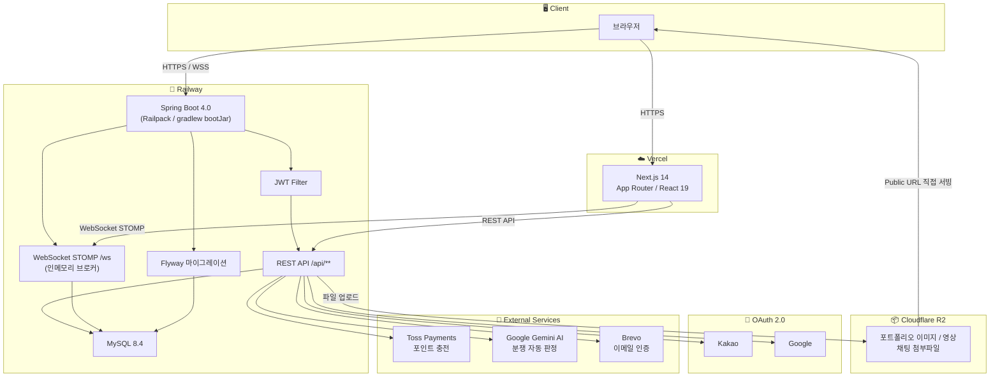

<!-- HEADER -->


<p align="center">
  투명한 단가, 검증된 포트폴리오 · 스트레스 없는 제작 파트너 찾기 · 한 플랫폼에서 연결합니다
</p>

<!-- 배포 링크 뱃지 (URL 교체) -->
<p align="center">
  <a href="https://aibe-6-project2-team03-one.vercel.app/">
    
  </a>
</p>

---

## 📌 서비스 개요

> 유튜버와 영상 편집자, 썸네일 디자이너를 연결하는 **전문 구인·구직 플랫폼**

현재 유튜브 시장에서 편집자·디자이너 채용은 오픈채팅·커뮤니티·SNS에 의존하고 있어
적정 단가 파악과 작업자 실력 검증이 어렵다는 문제가 존재합니다.

본 서비스는 **구인·구직 과정의 불투명성을 해소**하고,
실거래 데이터 기반 단가 정보와 검증된 작업자를 연결하는 것을 목표로 합니다.

<!-- 서비스 스크린샷 (이미지 교체) -->
<p align="center">
  
</p>

---

## ❗ 문제 정의

<table>
  <tr>
    <th>구인자 (유튜버)</th>
    <th>구직자 (편집자·디자이너)</th>
  </tr>
  <tr>
    <td>
      • 편집자 구인 공식 플랫폼 부족<br/>
      • 편집자 실력 객관적 판단 어려움<br/>
      • 적정 외주 단가 정보 부족<br/>
      • 작업 지연·잠수 등 거래 리스크
    </td>
    <td>
      • 안정적인 일감 확보 어려움<br/>
      • 포트폴리오 노출 공간 부족<br/>
      • 경력·실력 증명 수단 부족<br/>
      • 단가 책정 기준 불명확
    </td>
  </tr>
</table>

---

## ✨ 주요 기능

<details>
<summary><b>📋 구인·구직 게시판</b></summary>
<br/>

- 프로젝트 등록 (예산·작업 내용·썸네일 여부 선택)
- 프로젝트 지원 (포트폴리오·제안 금액 제출)
- 금액 미기재 게시글 노출 우선순위 하향 → 투명한 거래 문화 조성

</details>

<details>
<summary><b>🧑‍💼 포트폴리오 중심 프로필 시스템</b></summary>
<br/>

- 작업물 스타일별 그룹화 등록
- 유튜버의 직관적 스타일 탐색
- 결과물 중심 평가 → 신입도 공정하게 어필 가능

</details>

<details>
<summary><b>💬 실시간 채팅</b></summary>
<br/>

- 게시글과 무관하게 직접 연락 가능
- 파일·이미지 전송 / 견적 협의

</details>

<details>
<summary><b>⭐ 리뷰 & 랭크 시스템</b></summary>
<br/>

- 거래 완료 후 상호 평가 (작업 품질·커뮤니케이션·납기 준수)
- 랭크: `Rookie` → `Bronze` → `Silver` → `Gold` → `Platinum` → `Master`

</details>

<details>
<summary><b>🤖 AI 기능</b></summary>
<br/>

- **거래 대법관**: 분쟁 발생 시 AI가 거래 내용·채팅·작업 조건 분석 후 조정안 제시
- **글쓰기 AI 프롬프트**: 구인글·구직글·소개글 작성 시 AI 초안 생성

</details>

<details>
<summary><b>💰 안전결제 시스템</b></summary>
<br/>

- 포인트 충전 후 플랫폼 내 거래 진행 (Toss Payments 연동)
- 프로젝트 수락 시 포인트 **에스크로 보관** → 완료 시 에디터에게 정산
- 양측 동의 없이 취소 불가 → 거래 안전성 보장

</details>

<details>
<summary><b>🎯 맞춤 매칭 (블라인드 프로필)</b></summary>
<br/>

- 조건 기반 에디터 자동 추천
- 블라인드 프로필로 선입견 없는 매칭
- 단가·스타일·툴 등 세부 조건 필터링

</details>

<details>
<summary><b>🔐 소셜 로그인</b></summary>
<br/>

- Google OAuth2 / Kakao OAuth2 지원
- 이메일 인증 및 비밀번호 찾기 (Brevo 연동)

</details>

---

## 🛠 Tech Stack

### Frontend


### Backend


### Database & Storage


### Infra & 부가 서비스


---

## 📁 프로젝트 구조

```
├── frontend/                          # Next.js 14 (App Router)
│   ├── app/
│   │   ├── (main)/                    # 인증 필요 페이지 그룹
│   │   │   ├── admin/                 # 관리자 대시보드
│   │   │   ├── chat/                  # 채팅방 목록 / 상세
│   │   │   ├── community/             # 커뮤니티 게시판
│   │   │   ├── jobs/                  # 구인구직 게시판
│   │   │   ├── matching/              # 맞춤 매칭 (블라인드 프로필)
│   │   │   ├── mypage/                # 마이페이지 (포인트, 프로젝트, 포트폴리오)
│   │   │   ├── profile/               # 공개 프로필
│   │   │   └── settings/              # 계정 설정
│   │   ├── (public)/                  # 비인증 페이지 그룹
│   │   │   ├── login/                 # 로그인 (소셜 + 로컬)
│   │   │   ├── signup/                # 회원가입
│   │   │   ├── onboarding/            # 역할 선택 / 프로필 설정
│   │   │   └── forgot-password/       # 비밀번호 찾기
│   │   └── api/                       # Next.js Route Handler
│   │       ├── ai-draft/              # AI 글쓰기 초안 (Gemini)
│   │       └── og/                    # OG 이미지 생성
│   ├── components/
│   │   ├── admin/                     # 관리자 패널
│   │   ├── auth/                      # 인증 관련 컴포넌트
│   │   ├── chat/                      # 채팅 UI, 프로젝트 패널
│   │   ├── common/                    # 공통 컴포넌트 (NavBar, FAB, 알림 등)
│   │   ├── dispute/                   # AI 분쟁 조정 모달
│   │   ├── editor/                    # 리치 텍스트 에디터 (Tiptap)
│   │   ├── matching/                  # 맞춤매칭 카드
│   │   ├── post/                      # 게시글 카드 / 작성 모달
│   │   └── profile/                   # 프로필 컴포넌트
│   ├── hooks/                         # useAuth, useChatSocket 등
│   ├── lib/                           # API 클라이언트, 유틸
│   ├── store/                         # React Context (전역 상태)
│   └── types/                         # TypeScript 타입 정의
│
└── backend/                           # Spring Boot 4.0.6
    └── src/main/java/com/backend/
        ├── domain/
        │   ├── admin/                 # 회원/게시글 관리
        │   ├── auth/                  # 인증 (JWT, OAuth2, 이메일 인증)
        │   ├── chat/                  # 채팅방, 메시지, WebSocket
        │   ├── dispute/               # AI 분쟁 조정
        │   ├── matching/              # 맞춤 매칭
        │   ├── notification/          # 실시간 알림
        │   ├── point/                 # 포인트 / 안전결제 / Toss
        │   ├── post/                  # 구인구직 / 커뮤니티 게시글
        │   ├── profile/               # 공개 프로필, 포트폴리오, 리뷰
        │   ├── project/               # 프로젝트 (계약, 완료, 취소)
        │   └── user/                  # 유저 엔티티
        └── global/
            ├── ai/                    # Gemini API 클라이언트
            ├── config/                # Security, WebSocket, CORS 등
            ├── exception/             # 전역 예외 처리
            └── rsdata/                # 공통 응답 포맷
```

---

## 🚀 실행 방법

```bash
# 로컬 DB 실행 (Docker)
cd backend
docker-compose up -d

# 백엔드
./gradlew bootRun

# 프론트엔드
cd frontend
npm install
npm run dev
```

<details>
<summary><b>⚙️ 환경변수 설정 (backend)</b></summary>
<br/>

```env
DB_URL=
DB_USER=
DB_PASSWORD=
JWT_SECRET=
GOOGLE_CLIENT_ID=
GOOGLE_CLIENT_SECRET=
KAKAO_CLIENT_ID=
KAKAO_CLIENT_SECRET=
R2_ACCESS_KEY=
R2_SECRET_KEY=
TOSS_SECRET_KEY=
BREVO_API_KEY=
GEMINI_API_KEY=
```
</details>

<details>
<summary><b>⚙️ 환경변수 설정 (frontend)</b></summary>
<br/>

```env
NEXT_PUBLIC_API_URL=
NEXT_PUBLIC_TOSS_CLIENT_KEY=
```
</details>

---

## 🏗 시스템 아키텍처



---

## 🗄 ERD

<p align="center">
  
</p>

---


## 👥 팀원 소개

<!-- 팀원 정보 -->
<table>
  <tr>
    <td align="center">
      <br/>
      <b>0-0v</b><br/>
      <a href="https://github.com/0-0v">@0-0v</a>
    </td>
    <td align="center">
      <br/>
      <b>HeungJunBag</b><br/>
      <a href="https://github.com/HeungJunBag">@HeungJunBag</a>
    </td>
    <td align="center">
      <br/>
      <b>JuyoungKim1024</b><br/>
      <a href="https://github.com/JuyoungKim1024">@JuyoungKim1024</a>
    </td>
    <td align="center">
      <br/>
      <b>tke0329</b><br/>
      <a href="https://github.com/tke0329">@tke0329</a>
    </td>
  </tr>
</table>

---

## 🎯 기대 효과

- 유튜버·프리랜서 간 정보 비대칭 해소
- 실거래 데이터 기반 시장 단가 표준화
- 검증된 전문가 매칭
- 안정적인 구인·구직 환경 조성
- 유튜브 전문 인력 시장 신뢰도 향상

---

<!-- FOOTER -->

